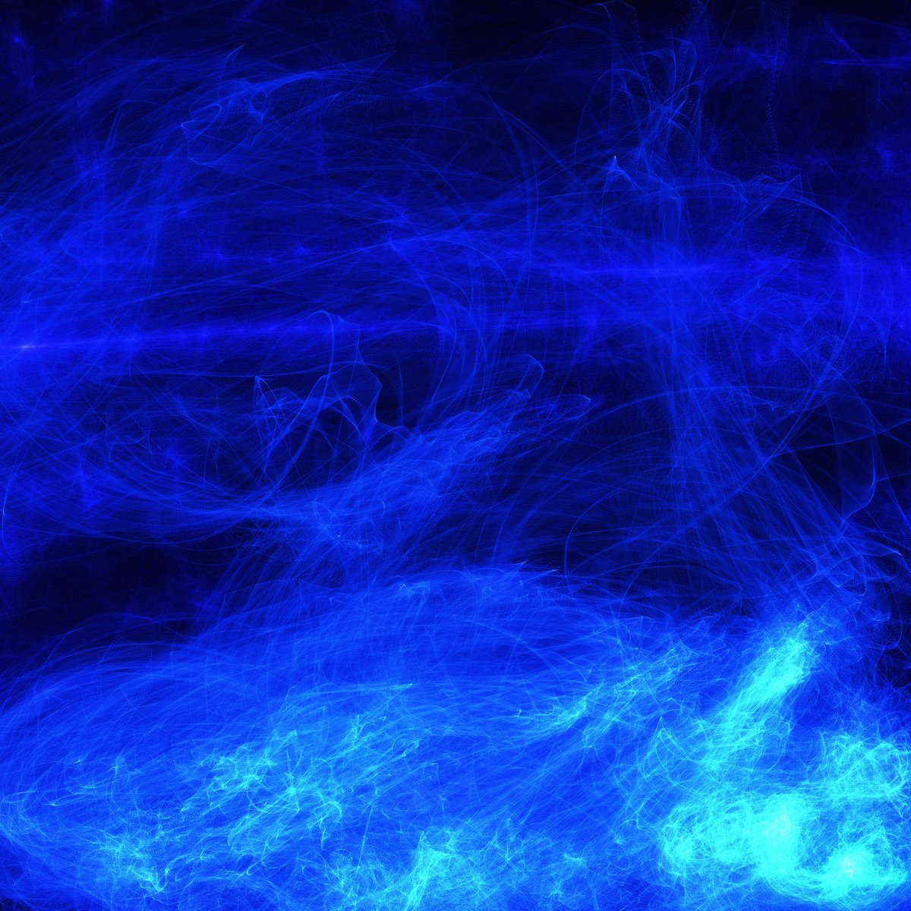
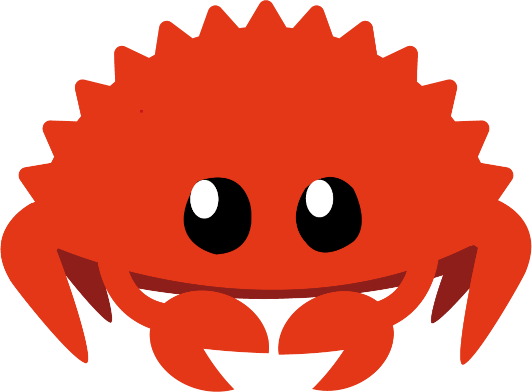

Link: [Rust Homepage](https://rust-lang.org)

---

### Bloczek kodu

```rust
fn main() {
    println!("Hello");
}
```

---

# Hello

To jest moja prezentacja

~ Autor prezentacji

--- 

## Drugi slajd

- Lista
- nienumerowana

1. Lista
1. numerowana
1234. (numerki nie mają znaczenia)
1. (więc się nie pomylisz)

---

---

### Obrazki




---

(O nie, gify jeszcze nie działają)

